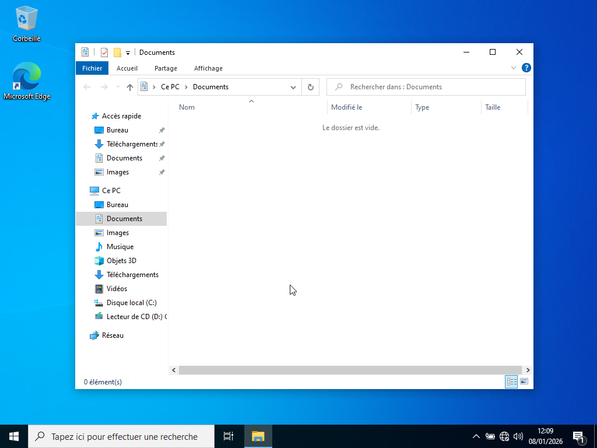
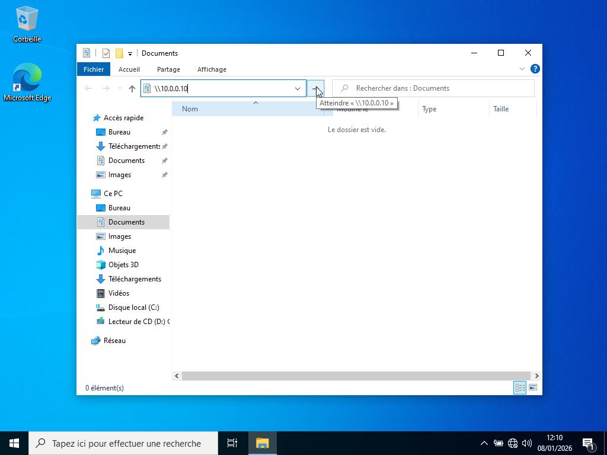

# ACCES AU DOSSIER PARTAGE

---

## Objectif :

Vérifier que l’utilisateur peut accéder aux ressources réseau selon les droits définis. 

---

## Procédure :  

La procédure utilisée est la suivante :

1. Depuis le poste client, ouvrir l’explorateur de fichiers. 

2. Dans la barre d’adresse, saisir : \\10.0.0.10\ 

3. Accès au partage  

4. Valider l’accès.

---

## Résultat attendu : 

Si l’utilisateur appartient au groupe autorisé, l’accès est direct. Sinon, Windows demande des identifiants du domaine.

---

## Démonstration : 

