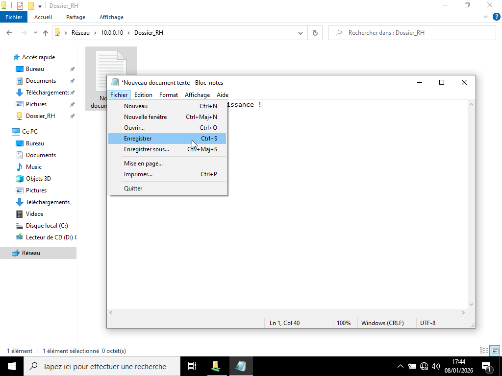

# VERIFICATION DES PERMISSIONS NTFS

---

## Objectif :

S’assurer que les permissions NTFS appliquées sur le dossier partage correspondent aux règles prévues.

---

## Procédure :

La procédure utilisée est la suivante : 

Tester depuis le poste client le dossier partage (ex : Dossier_RH) 

- Ouvrir le dossier partage

- Créer un fichier 

- Ecrire un texte dessus

- Enregistrer le texte.

---

## Résultat attendu : 

L'utilisateur du groupe domaine local peut lire ou écrire selon les droits définies.

---

## Démonstration :

Voir ci-dessous, une démonstration imagée sur la vérification des permissions NTFS.

